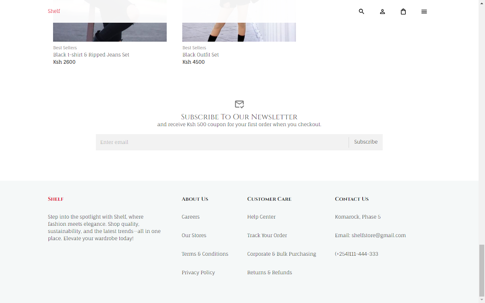

# Full Stack React Ecommerce App

- Fully Responsive.
- Stunning landing page with a carousel slideshow.
- Product list section has different types of filtering options.
- Email section to subscirbe
- Footer
## Technology used:
- Javascript & React
- Material UI for styling
- Redux toolkit for state management
- Stripe for payment
- Strapi for backend (Strapi is a headless CMS)
- React formik for form & validation

## Some Functions
- When you click on individual product item, you can see all relevant details
- You can see related products, description and reviews
- Items can be added and viewed from cart-menu
- User can proceed to checkout page
- Once you place your order, you can go to stripe checkout.

